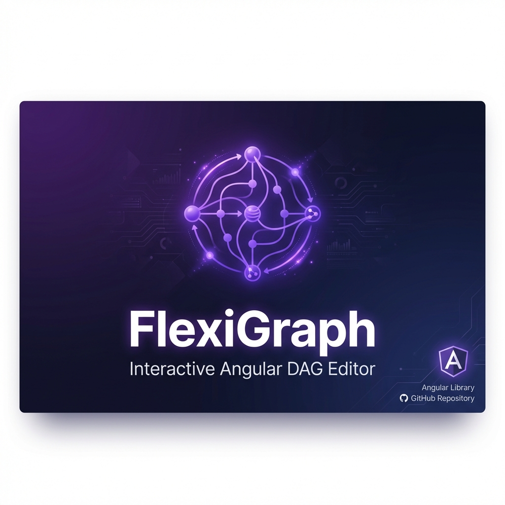
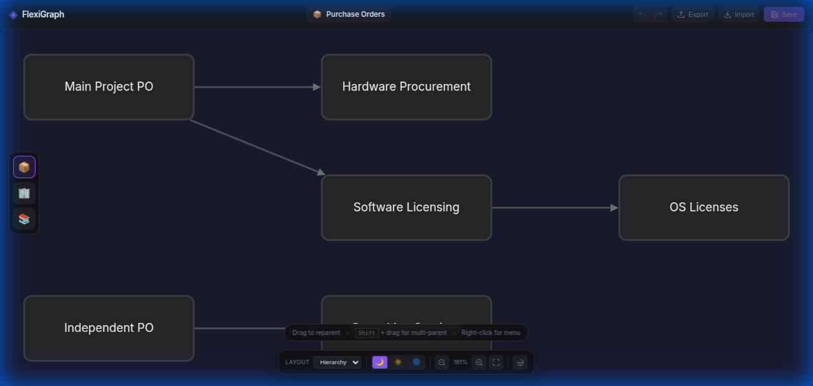
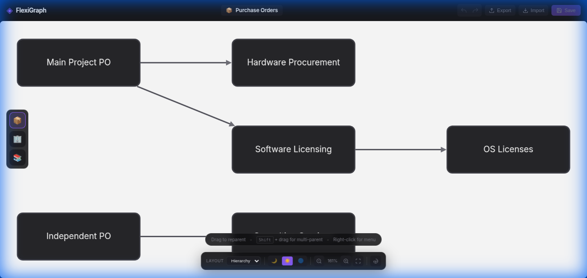

<p align="center">
  
</p>

<p align="center">
  <strong>A powerful Angular library for building interactive DAG (Directed Acyclic Graph) editors</strong>
</p>

<p align="center">
  <a href="https://www.npmjs.com/package/ngx-flexigraph">
    
  </a>
  <a href="https://bundlephobia.com/package/ngx-flexigraph">
    
  </a>
  <a href="https://angular.io">
    
  </a>
  <a href="https://www.typescriptlang.org">
    
  </a>
  <a href="LICENSE">
    
  </a>
  <a href="CONTRIBUTING.md">
    
  </a>
</p>

<p align="center">
  <a href="https://shubhanknagar.github.io/FlexiGraph/">🌐 Live Demo</a> •
  <a href="#-quick-start">🚀 Quick Start</a> •
  <a href="#-features">✨ Features</a> •
  <a href="docs/API.md">📖 API Docs</a> •
  <a href="#-contributing">🤝 Contributing</a>
</p>

---

## ✨ Features

<table>
  <tr>
    <td align="center" width="33%">
      <h3>🖱️ Drag & Drop</h3>
      <p>Intuitive node reparenting with visual feedback</p>
    </td>
    <td align="center" width="33%">
      <h3>🔗 Multi-Parent</h3>
      <p>Hold Shift to create DAG structures</p>
    </td>
    <td align="center" width="33%">
      <h3>📤 Rich Export</h3>
      <p>PNG, SVG, PDF, JSON, CSV formats</p>
    </td>
  </tr>
  <tr>
    <td align="center">
      <h3>↩️ Undo/Redo</h3>
      <p>Full history with Ctrl+Z/Y</p>
    </td>
    <td align="center">
      <h3>🎨 4 Themes</h3>
      <p>Dark, Light, Blue, High Contrast</p>
    </td>
    <td align="center">
      <h3>📐 6 Layouts</h3>
      <p>Dagre, Tree, Force, Grid, Circle</p>
    </td>
  </tr>
  <tr>
    <td align="center">
      <h3>📦 Collapse/Expand</h3>
      <p>Group node hierarchies</p>
    </td>
    <td align="center">
      <h3>🔍 Search</h3>
      <p>Find nodes quickly</p>
    </td>
    <td align="center">
      <h3>⌨️ Keyboard</h3>
      <p>Full shortcut support</p>
    </td>
  </tr>
</table>

---

## 🚀 Quick Start

### 1. Install

```bash
npm install ngx-flexigraph cytoscape cytoscape-dagre
```

### 2. Import

```typescript
import { FlexiGraphComponent } from 'ngx-flexigraph';

@Component({
  standalone: true,
  imports: [FlexiGraphComponent],
  // ...
})
```

### 3. Use

```html
<flexi-graph
  [nodes]="nodes"
  (nodeClick)="onNodeClick($event)"
  (nodeReparent)="onReparent($event)">
</flexi-graph>
```

```typescript
nodes = [
  { id: '1', label: 'Root', parentIds: [] },
  { id: '2', label: 'Child A', parentIds: ['1'] },
  { id: '3', label: 'Child B', parentIds: ['1'] },
];
```

---

## 📸 Screenshots

<p align="center">
  
  
</p>

---

## ⚙️ Configuration

```typescript
const config: FlexiGraphConfig = {
  styling: {
    theme: 'dark', // 'light' | 'blue' | 'high-contrast'
    nodeStyle: {
      shape: 'round-rectangle',
      width: 160,
      height: 44
    }
  },
  layout: {
    algorithm: 'dagre',
    direction: 'LR', // 'TB' | 'BT' | 'RL'
    animate: true
  },
  multiParent: {
    enabled: true,
    modifier: 'shift'
  }
};
```

See [full API documentation](docs/API.md) for all options.

---

## ⌨️ Keyboard Shortcuts

| Key | Action |
|-----|--------|
| `C` | Collapse selected node |
| `E` | Expand selected node |
| `A` | Add child node |
| `D` | Detach from parent |
| `Delete` | Delete node |
| `F2` | Rename node |
| `Ctrl+Z` | Undo |
| `Ctrl+Y` | Redo |
| `+` / `-` | Zoom in/out |
| `0` | Reset zoom |

---

## 🏗️ Development

```bash
# Clone
git clone https://github.com/ShubhankNagar/FlexiGraph.git
cd FlexiGraph

# Install
npm install

# Build library
npx ng build ngx-flexigraph

# Run demo
npx ng serve demo

# Run tests
npx ng test ngx-flexigraph
```

---

## 📁 Project Structure

```
FlexiGraph/
├── projects/
│   ├── ngx-flexigraph/      # 📦 Library
│   │   ├── src/lib/
│   │   │   ├── components/  # FlexiGraph, ContextMenu, etc.
│   │   │   ├── services/    # History, Export, Collapse
│   │   │   └── utils/       # Cytoscape transforms
│   │   └── package.json
│   └── demo/                # 🎮 Demo App
├── docs/                    # 📖 Documentation
├── .github/                 # 🔧 CI/CD Workflows
└── README.md
```

---

## 🤝 Contributing

Contributions are welcome! Please read our [Contributing Guide](CONTRIBUTING.md) first.

1. Fork the repo
2. Create a feature branch: `git checkout -b feature/amazing`
3. Commit changes: `git commit -m 'feat: add amazing feature'`
4. Push: `git push origin feature/amazing`
5. Open a Pull Request

---

## 📄 License

MIT © [Shubhank Nagar](https://github.com/ShubhankNagar)

---

<p align="center">
  <sub>Built with ❤️ using Angular and Cytoscape.js</sub>
</p>

<p align="center">
  <a href="https://github.com/ShubhankNagar/FlexiGraph/stargazers">⭐ Star this repo</a> if you find it useful!
</p>
